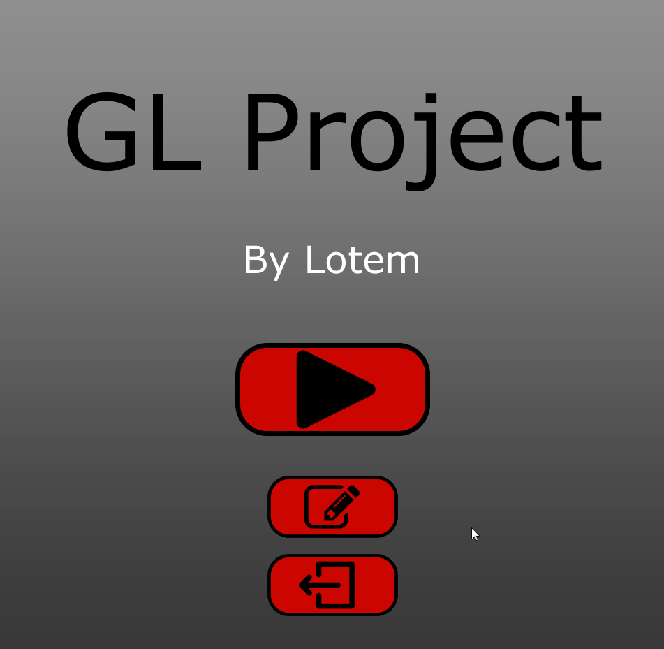

# GL Project  
(Temporary name)

## Overview
This is a work-in-progress 2D puzzle game, written in java using swing.
It is based on the mobile app "Flow", with extended mechanics.  

You are more than welcome to submit new levels, using the in-game level editor!

## Features
* Smart game-play with interesting mechanics
* 20 unique hand-made levels, separated into 4 worlds 
* A well-thought difficulty curve
* Custom game GUI and menus, made entirely from scratch
* In-Game level editor, for creating new levels and experimenting with the mechanics
  * Export and import levels from the level editor, to share your creations
  * Automated level solver for quick testing 
* Full abstraction, allowing easy implementations of new mechanics

## Screenshots
### The main menu and the first levels

### More simple level examples
< img src="https://i.imgur.com/RtJIShW.gif" width="400">

### The level editor
< img src="https://i.imgur.com/bQKsyG7.gif" width="400">

## Planned Features
* *Save progress*
* More tile types and game mechanics
* More levels and worlds
* Unlock worlds with stars